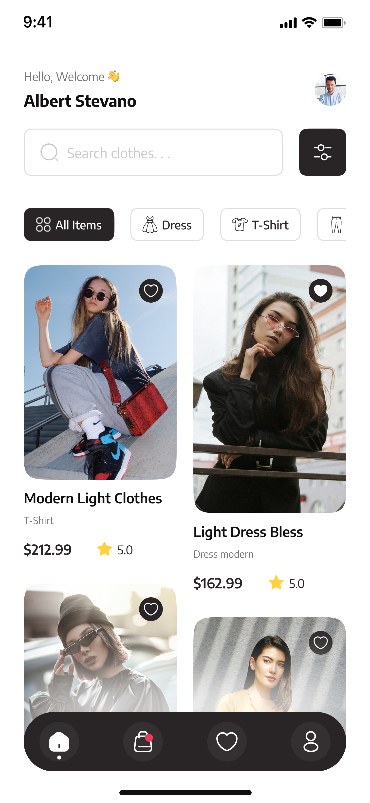
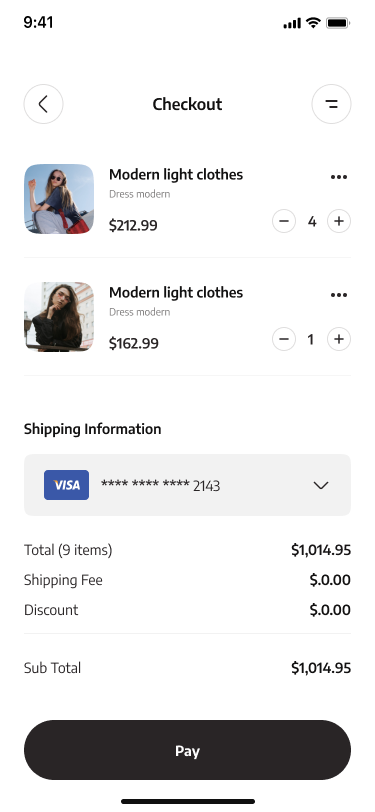
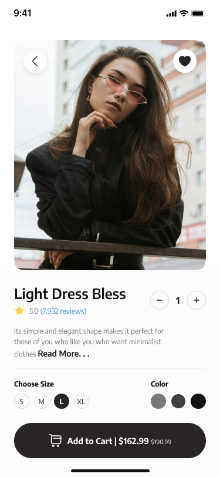

[](https://www.figma.com/community/file/1169625825293818878)

---

## ✨ Badges


---

# 🛍️ Mobile E-Commerce Clothing Store App

**A comprehensive Flutter E-Commerce & Online Shopping app** built with **Bloc**, **Clean Architecture**, and **modern Flutter best practices**.  

📱 Designed for performance, scalability, and beautiful UI across Android and iOS devices.  
⭐ Crafted for developers who want a ready-to-use, production-quality Flutter E-Commerce template with clean code architecture.  

[](https://github.com/AmrSalahDev/Mobile-eCommerce-Clothing-Store-App/stargazers)
[](https://github.com/AmrSalahDev/Mobile-eCommerce-Clothing-Store-App/network/members)
[](https://github.com/AmrSalahDev/Mobile-eCommerce-Clothing-Store-App/issues)

---

## 📥 Download APK

👉 **Latest Android Release**  
[⬇️ Download APK](https://github.com/AmrSalahDev/Mobile-eCommerce-Clothing-Store-App/releases/latest)

⚠️ Enable *Install from unknown sources* on Android.


---

## 📑 Table of Contents
- [🎯 Key Features](#-key-features)
- [✨ Badges](#-badges)
- [📊 App Architecture](#-app-architecture)
- [🚀 Getting Started](#-getting-started)
- [📦 Dependencies Used](#-dependencies-used)
- [🎨 Figma Design](#-figma-design)
- [📸 Screenshots](#-screenshots)
- [🛠️ Contributions](#️-contributions)
- [📜 License](#-license)

---

## 🎯 Key Features

### 👕 Product Browsing & Discovery
- **Browse Clothing Catalog** - Explore a wide variety of clothing items with images, prices, and ratings
- **Product Categories** - Filter products by clothing categories (T-Shirt, Dress, Jumpsuit, Tracksuit, Jacket, Sweater, etc.)
- **Search Bar** - Quick search functionality to find products with animated hint suggestions
- **Product Details Page** - View detailed product information including description, pricing, ratings, size & color selection
- **Product Card UI** - Modern product cards with images, ratings, prices, and favorite button
- **Image Caching** - Optimized image loading with caching for better performance
- **Shimmer Loading** - Elegant loading animations using shimmer effect while images load

### 🛒 Shopping Cart & Checkout
- **Add to Cart** - Easy product selection with quantity management
- **Shopping Cart** - Review items in cart, manage quantities, and view order summary
- **Checkout Flow** - Streamlined checkout process with shipping information and payment details
- **Order Summary** - Detailed breakdown of totals, shipping fees, and discounts

### 🎨 User Experience & Design
- **Responsive Design** - Perfectly optimized for all screen sizes using ScreenUtil
- **Smooth Animations** - Beautiful transitions and animations throughout the app
- **Sticky Navigation** - Sticky header on home page for persistent navigation
- **Toast Notifications** - Real-time feedback for user actions
- **Custom Icons** - Beautiful icon library (Lucide Icons) for consistent UI

### 🔧 Code Architecture & Best Practices
- **Clean Architecture** - Organized folder structure with Clear separation of concerns (data, domain, presentation)
- **BLoC Pattern** - State management using Bloc/Cubit for predictable state management
- **Dependency Injection** - Using GetIt and Injectable for loose coupling
- **Centralized String Management** - All app strings in `app_strings.dart` for easy i18n and maintenance
- **Code Generation** - FlutterGen for assets, colors, and DI configuration
- **Type Safety** - Full Dart null safety enabled

---

---

## 🚀 Getting Started

To run this app locally:

```bash
git clone https://github.com/AmrSalahDev/Mobile-eCommerce-Clothing-Store-App.git
cd Mobile-eCommerce-Clothing-Store-App
flutter pub get
flutter run
```

---

## 📦 Dependencies Used  

Below is a list of packages used in this Flutter project along with their versions:  

### 🚀 Core
- `flutter` – Flutter SDK  
- `cupertino_icons: ^1.0.8` – iOS-style icons  
- `meta: ^1.16.0` – Provides annotations for better code clarity  

### 📦 State Management & Dependency Injection
- `bloc: ^9.2.0` – Bloc/Cubit pattern for state management  
- `flutter_bloc: ^9.1.1` – Flutter integration for Bloc/Cubit  
- `get_it: ^9.2.0` – Simple service locator for dependency injection  
- `injectable: ^2.7.1+4` – Code generator for GetIt DI setup  
- `injectable_generator: ^2.11.1` – Generates boilerplate for Injectable  
- `talker_bloc_logger: ^5.1.10` – Bloc event logging and debugging  

### 🎨 UI, Animations & Design
- `flutter_screenutil: ^5.9.3` – Responsive UI scaling across devices  
- `flutter_svg: ^2.2.3` – Render SVG images with full support  
- `animated_emoji: ^3.2.1` – Animated emoji widgets with expressions  
- `animated_hint_textfield: ^1.1.1` – Animated hint text in input fields  
- `shimmer: ^3.0.0` – Shimmer loading effect for skeleton screens  
- `readmore: ^3.0.0` – Expandable/collapsible text widget  
- `auto_size_text: ^3.0.0` – Auto-sizing text widget for responsive text  
- `flutter_staggered_grid_view: ^0.7.0` – Staggered grid layout widget  

### 🔄 Routing & Navigation
- `go_router: ^17.0.1` – Declarative navigation & routing with deep linking  

### 📱 Native Features & UI
- `flutter_native_splash: ^2.4.7` – Native splash screen configuration  
- `flutter_sticky_header: ^0.8.0` – Sticky headers for scrollable content  
- `lucide_icons_flutter: ^3.1.9` – Beautiful, modern icon library  

### ☁️ Backend & Data
- `cached_network_image: ^3.4.1` – Caching & lazy loading network images  
- `dartz: ^0.10.1` – Functional programming features (Either, Option types)  

### 🛠️ Development & Build Tools
- `build_runner: ^2.10.4` – Code generation runner  
- `flutter_gen_runner: ^5.12.0` – Asset, font & color generator  
- `rename: ^3.1.0` – Rename app package & bundle ID easily  
- `change_app_package_name: ^1.5.0` – Change Android package name  

### 🧰 Custom Toolkit
- `my_flutter_toolkit` – Custom utility package  
  - Source: [MyFlutterToolKit](https://github.com/AmrSalahDev/MyFlutterToolKit)


---


### 🎨 Figma Design

Here’s the app UI design created in Figma:

[](https://www.figma.com/community/file/1169625825293818878)

📌 Click the image to view the live Figma prototype.


---

### 📸 Screenshots

<p float="left">
  
  
  
</p>


---

### 🛠️ Contributions

Feel free to fork the repo, open issues, or submit PRs to improve the app!
